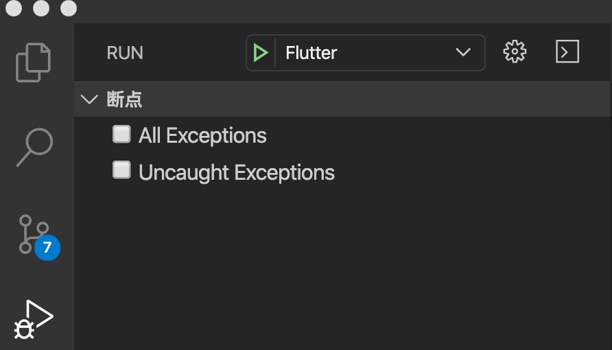

# flutter_wechat


### 概述

- 利用`Flutter` 来构建和模仿`微信7.0.0+ App`，且都是按照`原生微信App`页面，来开发和模仿滴，从而达到与原生 app 相近的视觉效果。

- 笔者于**2019 年 08 月**入坑`Flutter`开发学习，纯属小白一枚，此项目初衷还是想通过项目实践新技术，在业务实践中发现问题，从而积累技术经验，源码中有详细的注释，以及发现问题和解决问题的思路。

- 笔者希望初学者通过学习和实践这个项目，能够打开学习`Flutter`的大门。当然同时也是抛砖引玉，取长补短，希望能够提供一点思路，少走一些弯路，填补一些细坑，在帮助他人的过程中，收获分享技术的乐趣。

---

### ⚠️⚠️⚠️使用(Important)
-  项目环境
	+ **Flutter:**  ` 1.17.1 `
	+ **Dart:**  `3.5.1`

- 项目运行

  ```
	flutter packages get // 项目初始化插件 
	flutter run          // 项目运行
  ```
  

- **使用注意**

  - 还请优先使用`iPhone 7/8 Plus`的模拟器或真机，来运行整个项目. 根本原因：目前可能部分界面还未做完屏幕适配，以及笔者生前是一名`iOS开发`且用的是`iPhone 7 Plus`手机。

  - 登陆和注册：目前只支持`QQ账号`和`手机号`的登录或注册（PS：后期增加`微信号和QQ邮箱`登陆），且必须保证`QQ`或`手机号`的有效性。`密码`或者`验证码`可以随便输入，但必须是：`密码`长度需要保证在`8~16`位，`手机验证码`必须保证是`6位有效数字`
  
  - 去掉全局断点，否则模拟器运行时，点击输入框`TextField`时，程序老是会卡死，但真机无影响。
  
	

- 分支策略

	```
	master: 各个功能完整，且稳定，出现Bug优先处理
	dev: 笔者的开发分支，意识流且不稳定，但知识或技术会超前 master 分支，按需加载。
	``` 
- 真机调试
	+ **Android：**  `HUAWEI P30`
	+ **iPhone：**  `iPhone 7 Plus`

- **Issue提交**
	+ 首先，请先尝试拉取`master`最新的代码，看看`Bug`是否修复，目前此项目`dev`分支代码提交比较活跃，`master`分支代码比较稳定。
	
	+ 其次，检查你的`Flutter`版本是否和本人项目环境一致，**Flutter:  1.12.13+hotfix.7** 以上版本，各模块没啥问题的。`Flutter SDk` 更新命令：`flutter upgrade`。

	+ 最后，告诉我你是运行在哪个平台，`Android` 或者 `iOS`。若有问题，我会及时修复，谢谢。

---


### 期待

- 如果在使用过程中遇到 BUG，希望你能 Issues 我，谢谢（或者尝试下载最新的代码看看 BUG 修复没有）。
- 如果在使用过程中有任何地方不理解，希望你能 Issues 我，我非常乐意促使项目的理解和使用，谢谢。
- 如果通过该工程的使用和说明文档的阅读，对你在平时开发中有帮助，码字不易，还请点击右上角`Star`或`Fork`按钮，谢谢。
- 简书地址：<http://www.jianshu.com/u/126498da7523>

---

## 主页

|                   GitHub                   |                            掘金                             |                        简书                        |                     CSDN                     | 知乎                                                 |
| :----------------------------------------: | :---------------------------------------------------------: | :------------------------------------------------: | :------------------------------------------: | ---------------------------------------------------- |
| [点击进入](https://github.com/CoderMikeHe) | [点击进入](https://juejin.im/user/59128ee21b69e6006868d639) | [点击进入](https://www.jianshu.com/u/126498da7523) | [点击进入](https://blog.csdn.net/u011581932) | [点击进入](https://www.zhihu.com/people/codermikehe) |

---

### 商业互吹

- [iOS开发技术要点汇总](https://github.com/CoderMikeHe/MHDevelopExample_Objective_C)
- [Vue版WeChat](https://github.com/CoderMikeHe/vue-wechat)
- [iOS版WeChat](https://github.com/CoderMikeHe/WeChat)
- [WeChat资源汇总](https://github.com/CoderMikeHe/WeChat_Resource)

### 文档

- [Flutter 玩转微信——通讯录](https://www.jianshu.com/p/8d136f31b8a2)
- [Flutter 玩转微信——闪屏页妙用](https://www.jianshu.com/p/e2dcd0e8e04d)
- [Flutter 玩转微信——微信首页](https://www.jianshu.com/p/50eb989a8c49)

---

### 预览

###### 闪屏模块

|  |  |  |
| :------------------------------------------------------------------------------------------------: | :------------------------------------------------------------------------------------------------: | :------------------------------------------------------------------------------------------------: |


###### 登陆/注册模块

|        |       |      |
| :--------------------------------------------------------------------------------------------------: | :----------------------------------------------------------------------------------------------------: | :------------------------------------------------------------------------------------------------------: |
|  |  |  |

###### 微信模块

|  |  |  |
| :------------------------------------------------------------------------------------------------------: | :------: | :------: |
|  |                      |     

###### 通讯录模块

|  |  |  |
| :----------------------------------------------------------------------------------------------------: | :----------------------------------------------------------------------------------------------------: | :----------------------------------------------------------------------------------------------------: |


###### 发现模块

|  | 虚位以待 | 虚位以待 |
| :----------------------------------------------------------------------------------------------------: | :------: | :------: |


###### 我模块

|  |  |  |
| :--------------------------------------------------------------------------------------------------: | :--------------------------------------------------------------------------------------------------: | :--------------------------------------------------------------------------------------------------: |


###### 设置模块

|   |  |  |
| :-------------------------------------------------------------------------------------------------: | :---------------------------------------------------------------------------------------------------------: | :-------------------------------------------------------------------------------------------------------: |
|  |           |    |
